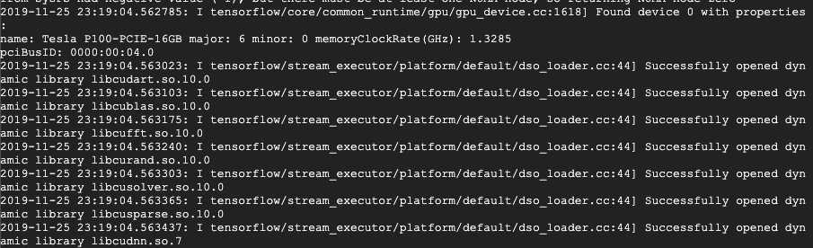

# CS229_Final_Project
Final project for stanford cs229. On tweet generation using gpt2.

## Running on GPU
1. Go to the VM instance [here](https://console.cloud.google.com/compute/instances?project=cs-229-final-project-259420).
2. Start the instance.
3. Click into the VM details and then click "SSH"  
  

4. Run the following commands: 
  ```
cd CS229_Final_Project  
cd trainer  
python baseline.py
  ```
5. If the code is properly running on GPU, you should see output similar to the following before the model actually starts training:  
  
